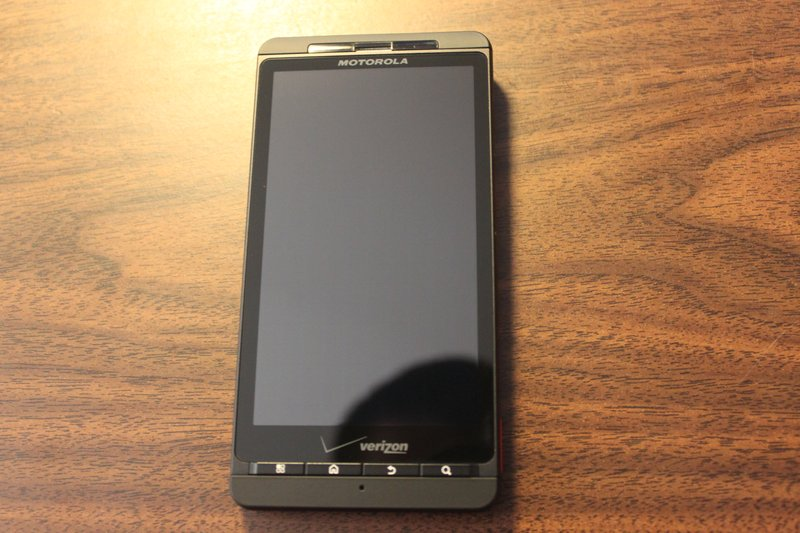
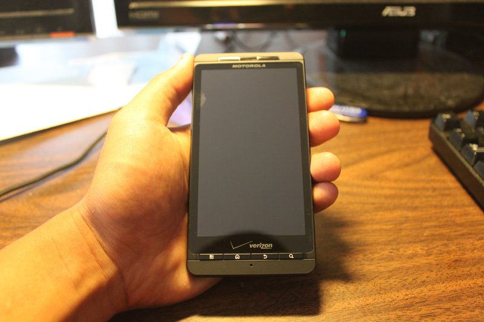
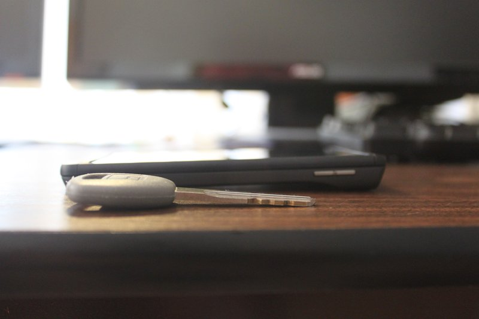
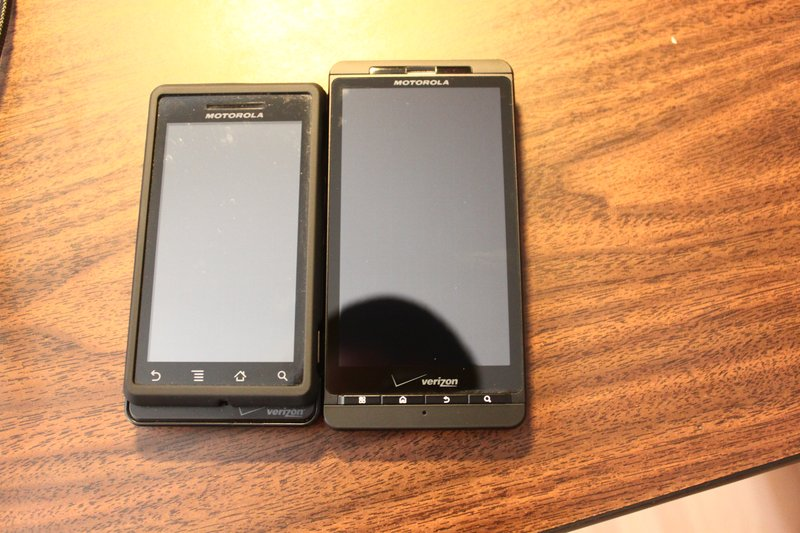
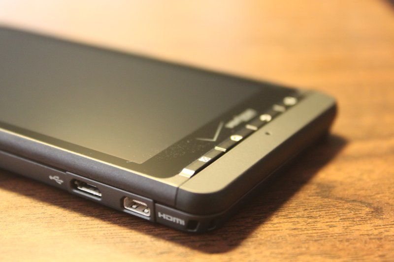
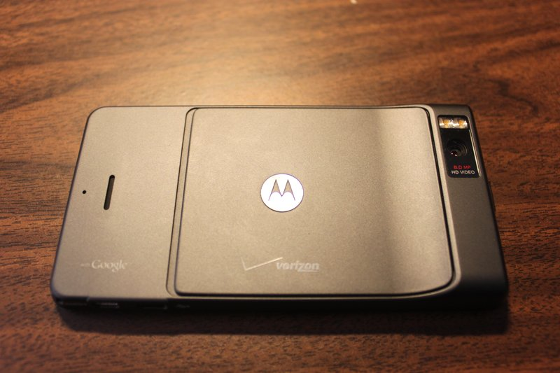
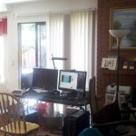
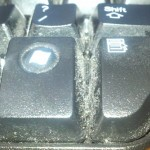

### Introduction

So I have been using this phone for almost 3 days now.  This review will go over the hardware and software of the Droid X briefly and what my impressions are.  This isn't a technical review with hard numbers and specs - I'm going to try to write this from a layman's point of view to make it more relative to the average reader.  This is a review that I promised for Jeff!

Droid X is the new flagship phone for Verizon, their answer to Sprint's exclusive, HTC Evo.  The HTC Evo for Sprint is heavily compared to the Droid X because they both have a massive 4.3' screen and they both are their respective carriers' exclusive top-tier android phone.  The Droid X is 199$ after rebate with a new contract.  The first batch is supposedly sold out and the next batch is due to ship July 23, 2010.

### Hardware

First thought: Wow, this screen is big.  For people with small hands, this phone might not be for you.  I would say my hands are average-sized and using the phone one-handed is not too difficult.  The phone is also very thin, with the thinnest part being perhaps as tall as 5 quarters stacked high \[does that comparison even help?\].  The weight is also deceivingly feather-light, holding it in my hand feels very natural with that "hump" on the top.

**Microphones + Physical Buttons:** The Droid X comes with three mics: one in the front for phone calls, a noise-cancelling one on the top, and one in the back for when you record video.  The phone only has 4 physical buttons besides the 4 small shortcut keys below the screen.  They are the: power/lock, volume up, volume down, and camera button.  They made the volume rocker smaller than the Droid, which I think is a disappointment because since the phone is much bigger, it is harder to reach and feel for the volume rocker so in my opinion, it would make sense to make it bigger to be more ergonomic.

**Physical Shortcut Keys:** Traditionally, android phones have the 4 shortcut keys on the bottom of the screen as "soft-touch" keys, where you don't need to press any buttons, you just have to lightly tap the area to execute the shortcut.  With the Droid X, they changed it and made them physical buttons.  I do like the tactical feedback and I like knowing whether I pressed the shortcut or not.  With the Droid, sometimes I think I pressed Home, for example, but the screen stays the same and I have no idea if the phone really registered my input at all.  With physical buttons, it takes away the ambiguity.  Physical buttons give you tactical feedback which is more preferred, but using the "soft keys" enable to you execute the shortcuts faster since you just have to tap, rather than press and release.  In all, both ways have their pros and cons, I am happy with either one.

**Screen Size + HDMI Port:** The screen is 4.3' \[diagonal measurement\] as mentioned before, and I think this should be as far as how big screen size on phones should be.  This is a good screen size for a phone that you will use heavily for browsing the web, watching videos, and games.  For me, the 4.3' screen really stands out when I am reading my Google Reader and watching youtube videos.  The Droid X is advertised as a multimedia phone so it includes a mini-HDMI port that you can use to output 720p videos.  However, I read a rumor that Motorola might have locked the mini-HDMI port so that it only works when you are in gallery mode, which essentially mean you won't be able to put your own movies or TV shows on the phone to watch on a bigger screen.  Take it with a grain of salt, I could not find any more information regarding this rumor, and I do not have my own mini-HDMI to HDMI cable to try it out yet.

**Back of the Phone:** The speaker phone is loud, it should accommodate for all your speaker phone needs except in the most noisiest situations.  The camera quality is so-so, it is not at the quality of a point-and-shoot camera, but I mean, I really am not expecting a super nice quality camera on a _phone_.  The camera on the Droid X is capable of 8MP although by default, it is set to 6MP.  More MPs != better quality, I do not like how companies use the # of megapixels to advertise their products as if more = better.  It really does not matter how much megapixels your camera has if the _quality of the camera sensor is a piece of crap._ I took some pictures with the Droid X below and you can judge for yourself how decent the camera is.  The UI for the camera is OK, it tries to be slick and fancy, but most people just want to change some settings quickly and take the picture.  I really like the soft-felt-like-matte on the back, it provides enough grip but won't cause the phone to be really annoying to take out of pockets.

**Battery Life:** A seemingly common problem among android phones are their battery life.  On average, I believe that my Droid X can last one day on a full charge.  It is hard to judge right now because I just got this phone so I am always turning it on and using it very frequently so obviously I drain the battery faster than everyday common use.  Optimally, I would prefer my phone to last at least a day and a half.  I eagerly wait for the ability to {over | under}clock so that like my Droid, I can underclock when the phone is in sleep mode to conserve battery \[it drastically increases your battery life when you underclock!\].

### Software

**Android OS:** I won't go too much detail into the software aspect of the Droid X because the android OS is very dense in terms of all the different features and nuances that it has to offer and I won't be able to sufficiently summarize it in one review.  But I must say that I absolutely love the flexibility of android, and the fact that I can think, "Hmm, I don't really like the skin and widgets that Motorola designed for this phone, I wonder if I can change that." and be able to actually do that.  I am not confined to only _one_ way to how my phone looks like, or only _one_ program that I am allowed to use to sync my device like iTunes.

**"Motoblur":** Motorola received a lot of negativity towards their custom skin, motoblur, in the past because it was very obtrusive and annoying.  For the Droid X, they made a major improvement in their skin \[which they insist to not call it motoblur\], but I personally still don't like it.  First thing I did when I got the phone was download LauncherPro and customized my home screen the way I liked it.  However, for some people, they might actually like Motorola's skin and widgets.  It's up to you how you want your phone to look like.

**Processor:** The Droid X comes with a OMAP3630 1GHz processor that makes this phone soooo smooth and slick.  Flicking between the different screens and switching between different applications is seamless.  This is very different from the Droid where sometimes I will sometimes see the phone stutter and freeze when I try to flick screens and open/close apps.  So far, the Droid X has never stuttered significantly and it never ceases to amaze me how fast apps are installed and how fast apps open on this beast of a phone.

**Swype:** The phone comes pre-installed with Swype, which I absolutely love.  Swype is created by the same creator as the T9 texting format that we all know and love on our dumbphones.  He claims that this is the future of texting, and I think that it suits most people well.  I type so much faster with Swype now compared to if I was trying to hunt and peck for everything.  My decision to get a Droid X was partially because I realized that I can use soft keyboards with no problem thanks to Swype, so I do not need a physical keyboard like the Droid 2 that will be coming out in August.  That is good because the phone is not as bulky when there is no hardware keyboard.

**Crapware:** One thing I don't like is the pre-installed crapware that came with the phone.  Apps like Blockbuster, some EA racing game, and Backup Assistant are some of the apps that annoy me because you cannot uninstall them \[besides the racing game demo\], until this phone gets rooted.  I think pre-installed crapware is something that can tarnish a nice phone like the Droid X simply because they exist on the phone and they won't allow you to easily uninstall it.  It is like buying a new HP laptop and seeing that it came pre-installed with a bunch of programs that you will never use.

### Conclusion

**\+ Solid, well-built hardware.  It feels like a solid and refined product, and it does not feel cheap.  Motorola has done very well with the hardware-aspect of their Droid lineup so far.**

**\+ Screen size, some may find it too big but for me, I think its great for reading and watching videos.  Pinch-and-zoom is excellent.**

**\+ Smooth, slick and speedy UI experience because the Droid X sports the new generation of the OMAP processor.  The phone performs exceptionally well and when the 2.2 update comes out next month, it will only be even better, thanks to JIT.**

**\- Small volume rocker seems unintuitive since the size of the phone makes it hard enough to reach the rocker, it should be bigger to make it easier to feel and press.**

**\- Comes pre-installed with a handful of crapware that is not necessary and only serves to clog the apps list with applications and trial programs you'll probably never use.**

**\- Battery life is not as good as it can be, but hopefully the ability to underclock will help the battery life.**

**\- Bootloader is encrypted and there is also an e-fuse chip that checks whether the firmware and kernel among other things is what Motorola designated.  If you try loading a custom ROM on the phone, the phone will not boot and it will need to have the stock ROM re-installed before you can boot.  Essentially, you cannot mod your phone and install custom ROMs on the Droid X.  Root will still be possible that will allow you to over/underclock, uninstall crapware and wifi tethering.**

### Final Thoughts

I recommend this smartphone for people who use a smartphone often to browse the internet and are heavy consumers of multimedia.  I am really hoping that android developers can do some exciting things with this phone although the chances of installing custom ROMS are zero to nilch.  Root should be inevitable, the potential for this phone is huge and I am excited for the future of Droid X.

### **Motorola Droid X Video Camera**

### Motorola Droid X Camera Pictures

       ****
