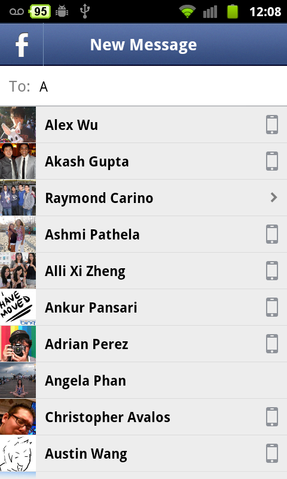
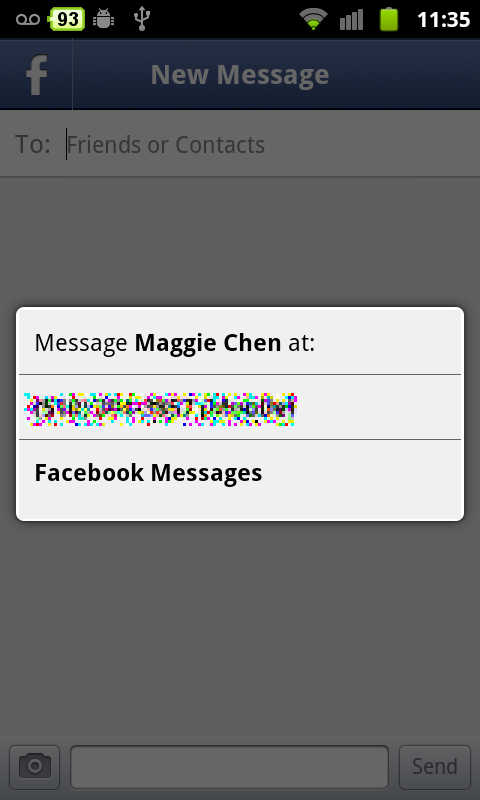
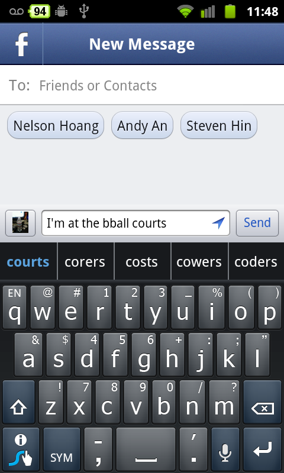
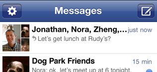

Today, Facebook announced a new standalone-app called [Facebook Messenger](https://www.facebook.com/mobile/messenger).  Tech-savvy users might have heard of WhatsApp or Beluga (which was bought by Facebook to create Facebook Messenger), which are mobile messaging apps that Facebook Messenger _will_ eventually replace.  This app is killer because it essentially replaces SMS and all other forms of mobile communication.

### So what's the big deal?  Why should I use it?

Some of you might be wondering what the heck is Facebook Messenger, and why you should or should not use it.  This article is here to help you understand it better and why you might want to try it out -- and if you feel like this article might help others, feel free to recommend it to your friends up top ;P.  The download links are at the bottom.

Facebook Messenger makes it **extremely** easy to communicate with your friends on a mobile device.  Think about the other alternatives that you might be currently using: Google Talk, it works well with other people who have Android devices since Talk is installed on every Android device, but you need to find and add buddies.  SMS, bad but works if you have their phone number, unfortunately, it costs money for a SMS plan and not very useful (can't specify location or group chat).  WhatsApp, decent because it works on any device but you need to convince your friends to install WhatsApp.  BBM/iMessage: Platform-specific, can't be used by everyone.  The current choices out there have common lacking functionality that Facebook Messenger addresses.

#### 1\. Message anyone that is your friend on Facebook, as well as your phonebook contacts

The common problem in GTalk and every other mobile messaging app is the lack of friends.  You have to proactively reach out to others to find out if they use the same service as you, and then add them in order to begin using their product.  I used GTalk prior to Facebook Messenger, and it is great for communicating only with my closest friends that use Android.  However, it becomes difficult when I want to message other people who don't fit that category.

With Messenger, you won't have to ask somebody for their phone number or their screen name -- as long as you are friends on Facebook, you can instantly message them.  As you can see in the screenshot, Messenger lets me communicate with any of my friends instantly without having to worry about whether they have text, or if they have this app or not.  It ignores all platform barriers (Android/iOS/RIM/etc) and thus, makes it possible to connect with anybody with a mobile device.  I would say this is the number one feature, which is the ability to message anybody that you are friends with on Facebook instantly.

#### 2\. SMS Integration 

**Facebook Messenger is going to kill SMS** as the primary form of mobile messaging.  It really does not make sense to pay for a SMS plan anymore.  We all know (or at least should know) that [carriers pay virtually nothing for text messages](http://www.techvibes.com/blog/whats-in-a-text-message-the-real-cost-of-sms-and-just-how-badly-wireless-carriers-are-ripping-you-off-2011-07-05) and it is an extremely archaic way to communicate with somebody (140-char limit, and no rich media integration such as pictures or location).

In this screenshot, you can see that I have the choice between sending the message to her mobile number, or to her inbox 0n facebook.com.  If the people you message use Facebook Messenger, then they will instantly receive a push notification on their phone when you send them a message.  If you message someone who does not have Facebook Messenger on their mobile device, then you can send the message via SMS _for free_, as long as their number is supported (you can't send to some international carriers).  I think it's really important to note that last part when **you are able to send texts for free**.

 

#### 3\. Location and Photo Sharing

How many times have you wanted to tell somebody where you are when trying to meet via texts?  I remember reading this [reddit post](http://www.reddit.com/r/reddit.com/comments/hxkrz/a_modest_proposal_to_make_finding_coordinating/) a while back and sharing the hivemind's sentiment, "Why don't we have something like this already?".  Sharing a map view is such a useful feature to have when trying to coordinate a place to meet and Facebook Messenger allows you to do just that.  If you share your location, friends can view a map that they can then search how to find directions to your current location.  I love how Facebook Messenger's arrow icon is **almost exactly** the same as the image link in the reddit post, it's almost as if they reddit themselves and listened to the hivemind.  As usual, you can turn off location sharing for all messages as well as on a per message and per thread basis.  Attaching photos is also nice, good for quickly sharing pictures taken on your phone with someone...or a group of people.

#### 4\. Group Chat

Not much that needs to be said.  There has definitely been times when I had to use SMS to communicate with multiple people and it was laughably pathetic.  It was like playing telephone.  With group chat, everyone can stay synced and it makes coordinating and planning easier, especially when you use group chat with **number 3**.

 

### Conclusion

I have been using it for a few weeks now (internal dogfooding ftw), and it is quite solid for a version 1.  I have chosen Facebook Messenger already as my default for mobile messaging.  Sure, on occasion, I'll still use GTalk and sometimes Google Voice for texting, but if I can convince my closest friends to use Facebook Messenger, then there will be no reason to use any other service.  I can instantly message them, attach pictures as well as share my location, and also start group conversations to communicate with multiple people.

However, there are still some things I don't like about it.  For example, although I can send SMS to most of my friends, for those I have convinced to use Google Voice entirely for texting, I am not able to since it doesn't support sending SMS to Google Voice numbers.  When I tried sending a text to a Google Voice user, an error message pops up but it is not apparent to me that it doesn't work because Messenger doesn't support his carrier.  And if I can't send to his mobile number, then why can't I select the option to send a Facebook message instead?  Also, a nitpick is when creating a new conversation, it is difficult to understand what the mobile icon next to their name meant.  As of now, I believe it means it'll be sent to their mobile phone.  Lastly, for some people, having more customizable alert muting options also would be more useful.

A few weeks ago, during the Skype Video integration launch, Mark Zuckerberg said that "this is possible because the social infrastructure exists, the system knows we’re connected and we have the pipe open between us so new applications can flow between us".  Facebook is at a very strategic advantage where they have something that no other company has, and that is your social graph.  With that "social infrastructure" in place, applications that use Facebook will inherently be better than the ones that don't.  Facebook Messenger is an excellent example where it is already better than the current options out in the market right now because it is built on top of your social network.

\[[Android Market link](https://market.android.com/details?id=com.facebook.orca)\]\[[iPhone App Store link](http://fb.me/msgrupgrade)\]
