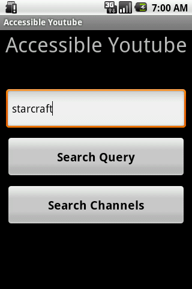
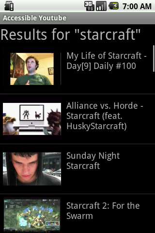
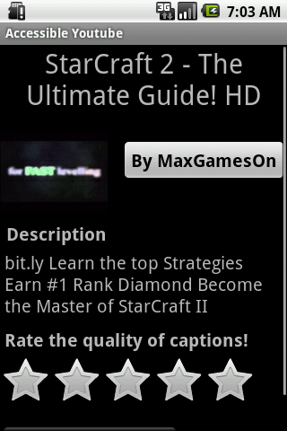

### Background

Last year, I had the privilege of attending Google I/O and it was nothing short of amazing.  When registration opened up for Google I/O 2011, it was [sold out in 59 minutes](http://techcrunch.com/2011/02/07/google-io-tickets-sell-out-in-59-minutes/).  I tried registering about 30 minutes upon opening, but I was unable to get a ticket.

Luckily, Google launched a contest called [Last Call for Google I/O](https://sites.google.com/site/lastcallforio2011/Home), which they describe as

> "A contest that spans 10 days, 10 developer challenges and 100 chances to win tickets to attend the now-sold-out Google I/O 2011."

I knew that this was my chance to win a ticket.  For each category, there was two rounds that developers must go through.  Round 1 is just a fast quiz that everyone enters, only the quickest and most accurate 200 submissions will move on to Round 2.  Round 2 is a 24-hour coding challenge, out of the 200 individuals that make it, only 10 will be selected for a free pass to Google I/O.

### AccessibleYoutube

I made it to Round II in the Accessibility category, and for Round 2, the goal was to design an Android app that searches **only** for YouTube videos that have captions.  It must then be able to playback the video and be able to quickly share the URL with others.  It also must be accessible-friendly (obviously).

After 24 hours of disregarding homework, classes, and sleep to finish this app, I submitted it with little hope of winning.  I did not fully satisfy all the specifications, and my app was not optimized at all (Mark and I agree that it is quite the POS).

However, on April 4th, I received the great news that I was one of the 10 winners!  They even [featured my name on the contest website](https://sites.google.com/site/lastcallforio2011/accessibility) along with the other winners.  Also, Google Code wrote a [blog post](http://googlecode.blogspot.com/2011/04/and-glory-goes-tolast-call-for-google.html) that goes into more details about the winners of each category.

### Conclusion

I will be attending Google I/O again this year, and I already can't wait for it to begin.  I learned my lesson this year...next year I will make sure to be ready by the second.

In case anyone is interested, the source code for my AccessibleYoutube android app is [here](https://github.com/meltedxice/AccessibleYoutube).

### Screenshots of AccessibleYoutube

 
