_This is a tutorial created by Jesse Chen and guest contributor [Jonathan Tien](http://www.ocf.berkeley.edu/~jotien/portfolio/).  Jonathan is a Product Manager at Glassdoor.com and a recent Cal grad, where he got his degree in Computer Science._

### Free pictures?  What?

Congrats new grad.  Now that graduation is over, photo proofs have been sent to you online for you to view.  The only problem is, you can't seem to save those pictures!  Right clicking on the website seems to be disabled and you really want to see and share the images without that ugly copyright overlay or the proof watermark right in the middle of the picture.  Don't worry.  In this article, my buddy Jonathan Tien and I partnered up to teach you how to grab the image off the website, and use Photoshop to remove the proof watermark from the image.

### Getting the image

For UC Berkeley graduates, find your photos [here](http://www2.gradimages.com/).  Find your name on the list, and you should arrive on a page that [looks like this](http://www2.gradimages.com/Proofs?PIN=17823395&LastName=CHEN):

[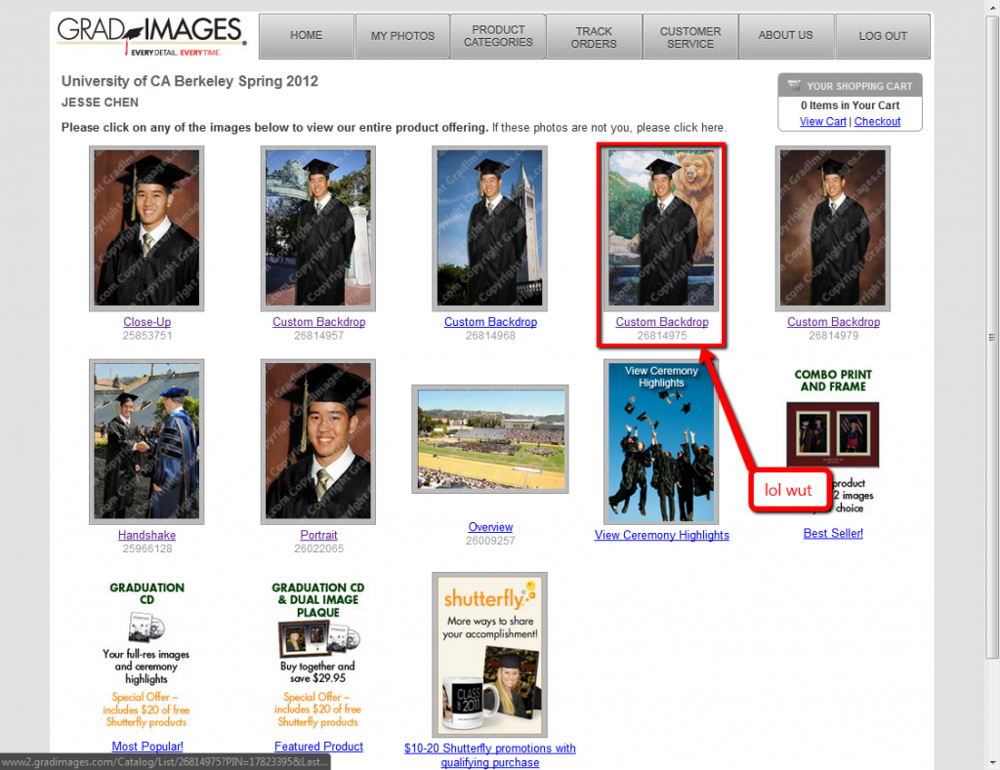](http://www.jessechen.net/blog/wp-content/uploads/2012/05/2012-05-23_1820.png)

Now, lets choose an image that we want to grab.  I really like the picture with the creepy bear standing in the background, so lets get that one.  Click on that image, and you should be [directed to this page](http://www2.gradimages.com/Catalog/List/26814975?PIN=17823395&LastName=CHEN).  Click the "View Larger" link on the left sidebar to see a bigger image.  Good, now it should look like this:

[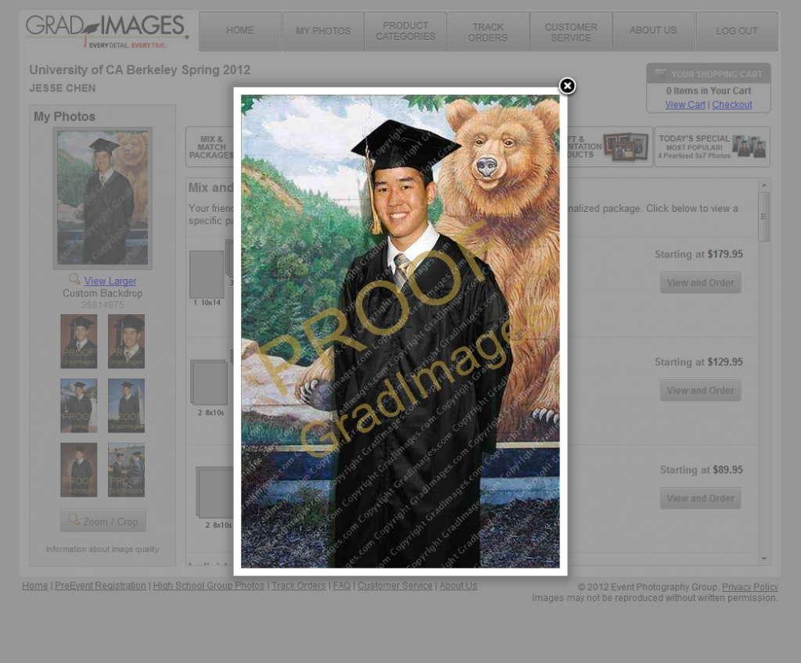](http://www.jessechen.net/blog/wp-content/uploads/2012/05/2012-05-23_1826.png)

Now, the hardest part.  What browser are you using?  Depending on your browser, we'll have to do different things.  Chrome, Firefox, Internet Explorer?  Pick your poison.

#### Chrome

Press "CTRL  + SHIFT + i" to launch the WebKit Developer Tools.  If that doesn't work, go to the wrench icon on the top right, then Tools > Developer Tools.  If you see something like this, you're doing it right. 

[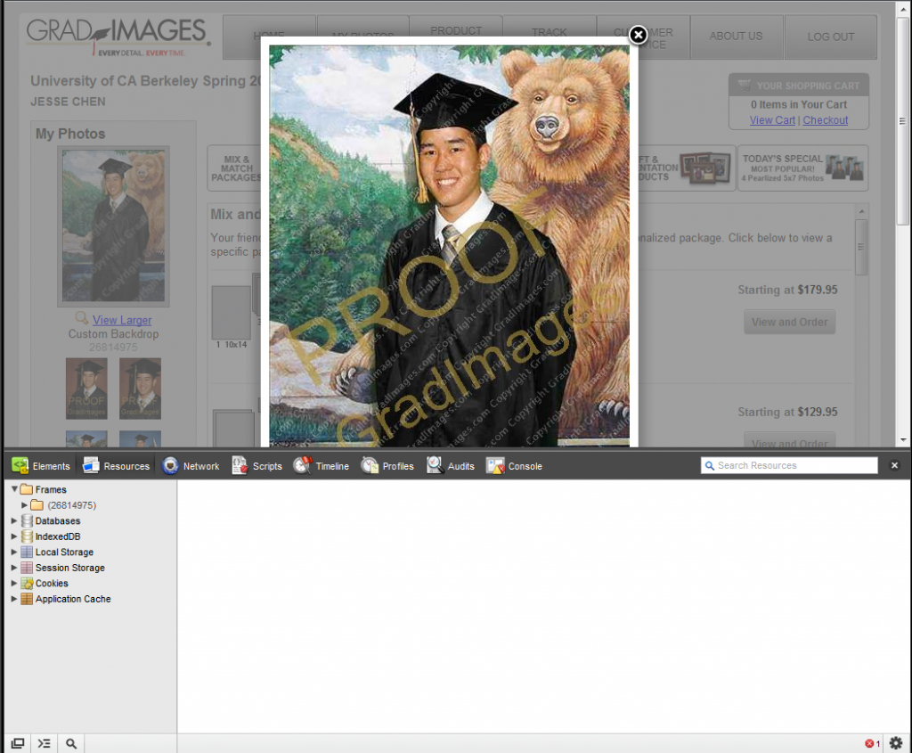](http://www.jessechen.net/blog/wp-content/uploads/2012/05/2012-05-23_1834.png)

Make sure you're on the "Resources" tab.  Expand the folder under "Frames".  In the picture above, that'd be the "(26814975)" folder.  Find the "ZoomHandler.ashx" file and double click it to open the image in a new tab.  Or right click the image to open it in a new tab.

[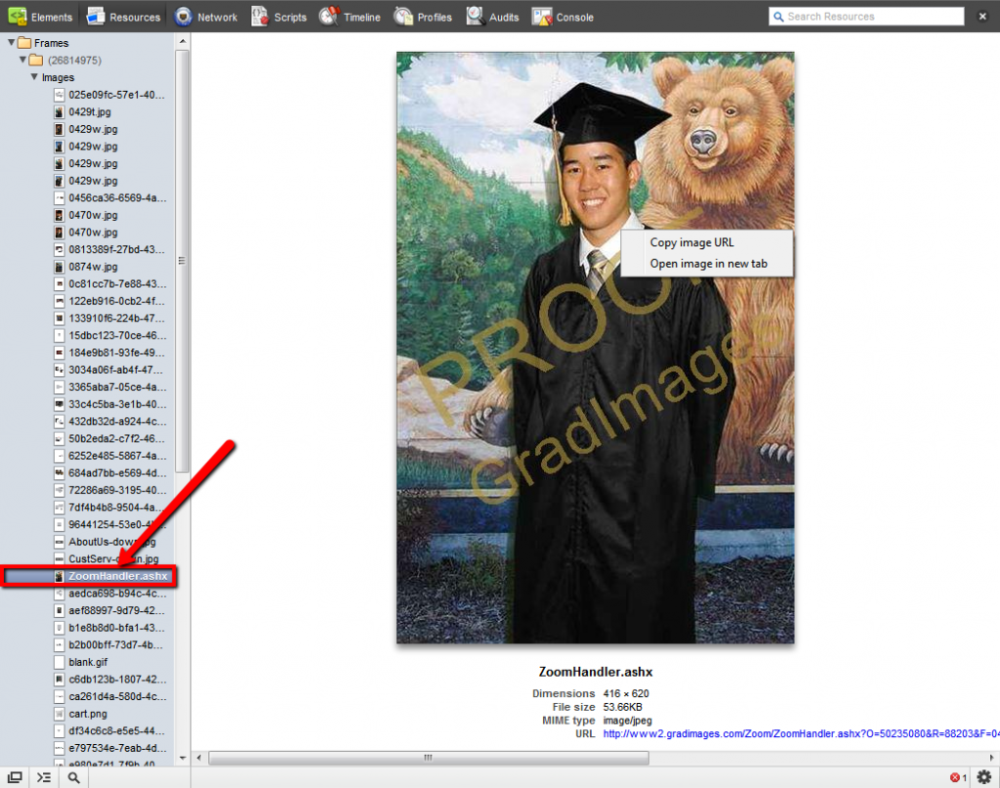](http://www.jessechen.net/blog/wp-content/uploads/2012/05/2012-05-23_1839.png)

From here, right click and "Save image as..." onto your computer.

#### Firefox

Cool.  Press "CTRL + SHIFT + i" or go to the menu and Web Developer > Inspect.  Move your mouse so that its over the large image in the middle.  The little bubble should say "div.OverlayZoom".  Now click on the second-to-the-right button so that the popup says div.Zoom.Vertical.  Click the "Style" button on the bottom right and click the background-image property.  Copy and paste the URL, make sure to get the whole thing!  It should start with "www2" and should not have any quotes or apostrophes at the end of the URL.

[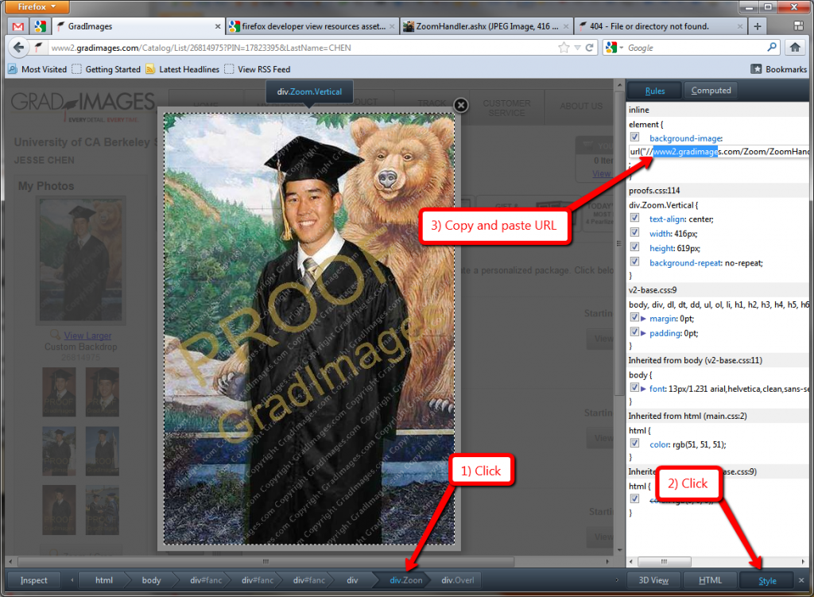](http://www.jessechen.net/blog/wp-content/uploads/2012/05/2012-05-23_1853.png)

Open the URL in a new tab, and "Save image as..." onto your computer.

#### Internet Explorer

Oh dear.  This is for Internet Explorer 8, instructions might vary for other versions of IE.  Press "F12", or go to Tools > Developer Tools.  A new window should pop up.  Type "zoomhandler" into the search bar, and grab the URL under the background-image property.

[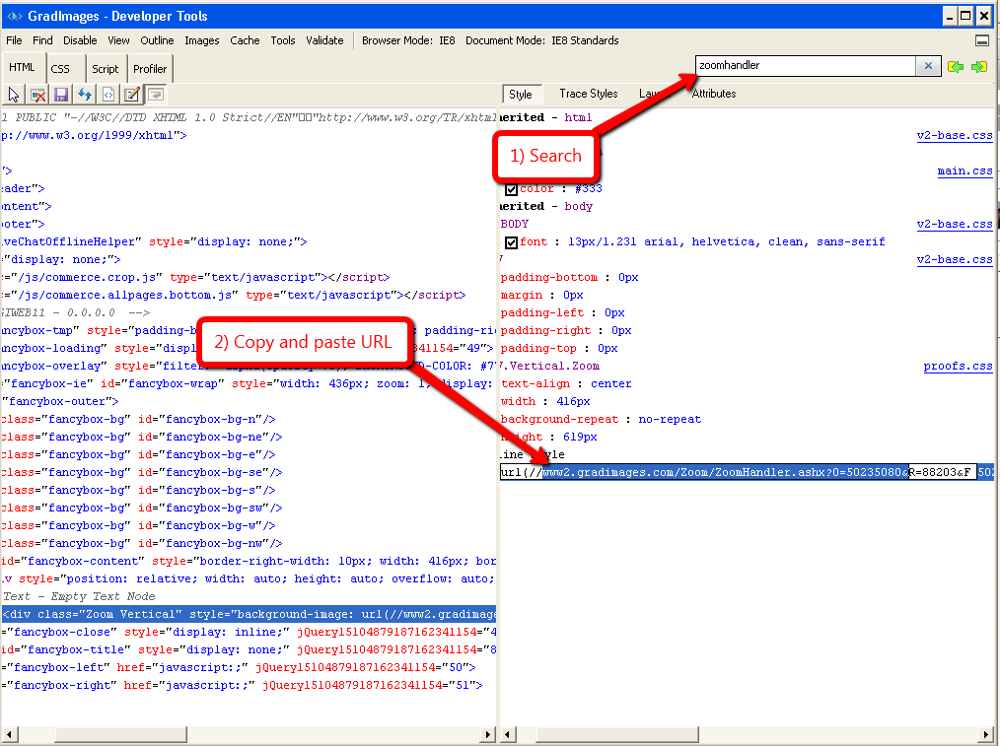](http://www.jessechen.net/blog/wp-content/uploads/2012/05/2012-05-23_1911.png)

Open the URL in a new tab, and "Save image as..." onto your computer.

### Photoshop Magic Time

Once the image has been saved onto your computer, its time to use Photoshop to remove the watermark from the image.  Also, did you know [all UC Berkeley students get Photoshop for free](http://ist.berkeley.edu/software-central/adobe)?  Jon will take it from here.

* * *

Now we have our picture. The only problem is the giant yellow text splayed across it. To get rid of it, we’ll have to use some Photoshop tricks, namely content-aware fill. (Note: this tutorial heavily relies on the use of content-aware fill, which is only available in Photoshop CS5. If you have an older version you’ll have to use an alternate method to remove the yellow text).

[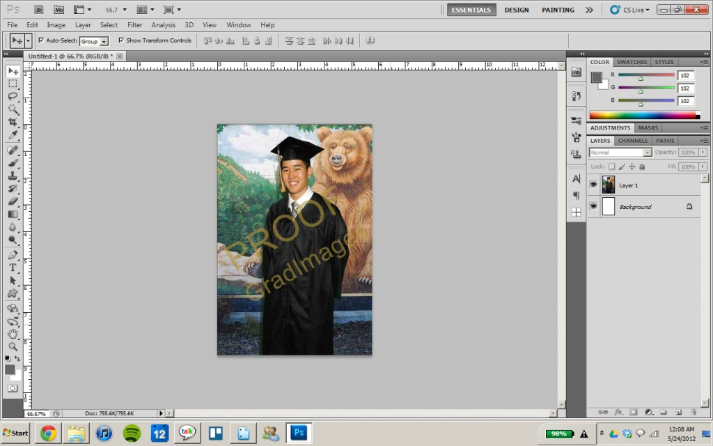](http://www.jessechen.net/blog/wp-content/uploads/2012/05/1.jpg)

_(fig. 1: starting point)_

The first thing we want to do is select the area the text covers. You could potentially do this using the magic wand tool, maybe the quick select tool, or even the lasso tool. But its actually easiest to just overlay identically formatted text and use that as a mask. We’ve gone ahead and done the troublesome part for you and figured out the formatting for you.

The font is Helvetica, but Arial works fine too (the two are nearly identical). “PROOF” is ~100pt and “GradImages” is ~65pt, bolded. Both lines are rotated exactly -30 degrees (to do the rotation, access the text layer’s transform tools, and then type in the value manually. If this is all Greek to you, Google is your friend - there are a lot of very helpful Photoshop tutorials out there).

[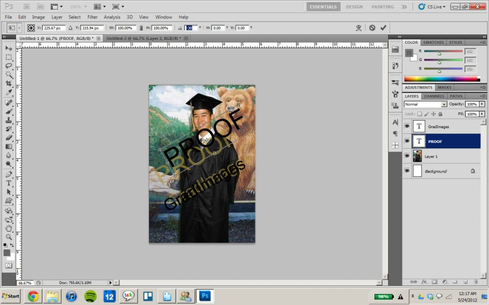](http://www.jessechen.net/blog/wp-content/uploads/2012/05/2.jpg)

_(fig. 2: rotate both layers -30 degrees -- see highlighted field in the toolbar)_

After aligning the text layers, you should eventually end up with something like this:

[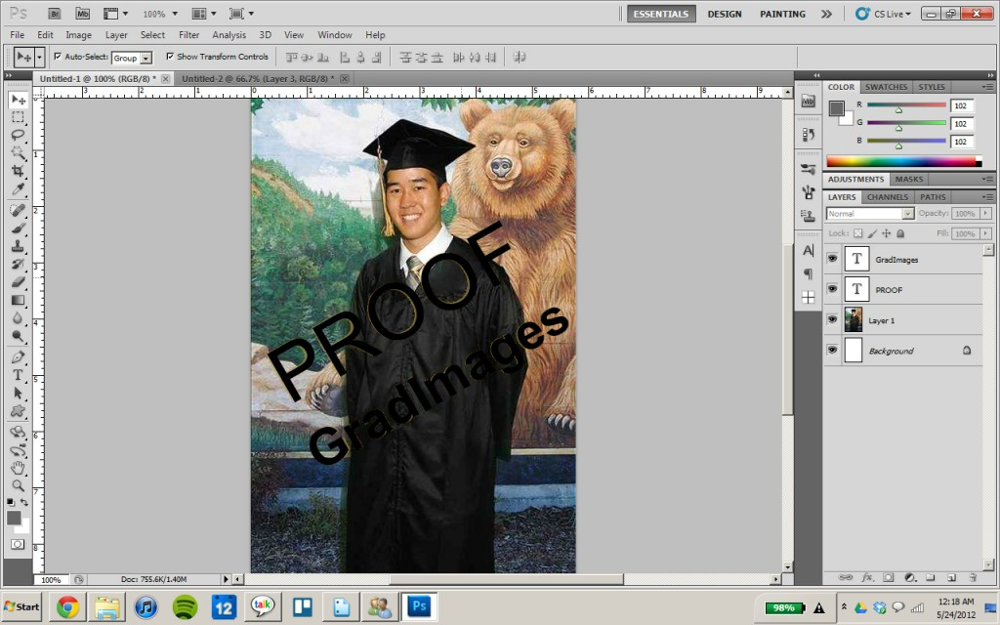](http://www.jessechen.net/blog/wp-content/uploads/2012/05/3.jpg)

_(fig. 3: not perfect, but overlaps well enough for our purposes)_

Now we want to rasterize these two layers and select them (so that we can select the yellow text underneath). Select the two layers (hold SHIFT and click both of them) and then hit CTRL+E to merge and rasterize them (alternately, you can go to the Layer menu and select the “Merge Down”). You should end up with something like this:

[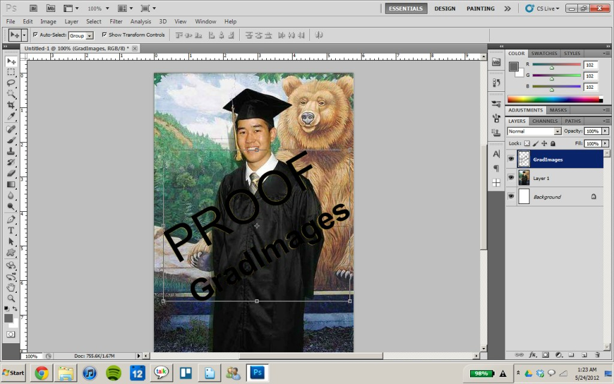](http://www.jessechen.net/blog/wp-content/uploads/2012/05/5-1.jpg)

_(fig. 5: in the layers panel, there is now only one, rasterized layer)_

Now we can easily use the magic wand tool to select this text, then hide that layer and apply the selection to the original image’s yellow text. (to make your life easier, de-select “contiguous” in your magic wand’s options to select all the black text at once).

[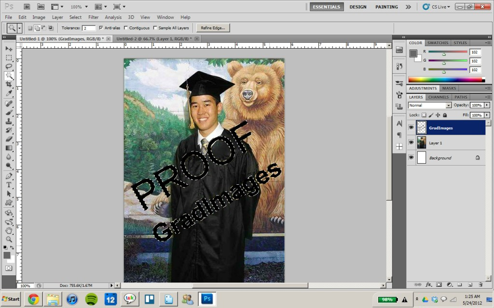](http://www.jessechen.net/blog/wp-content/uploads/2012/05/6.jpg)

_(fig. 6: selecting our rasterized text using a non-contiguous magic wand)_

[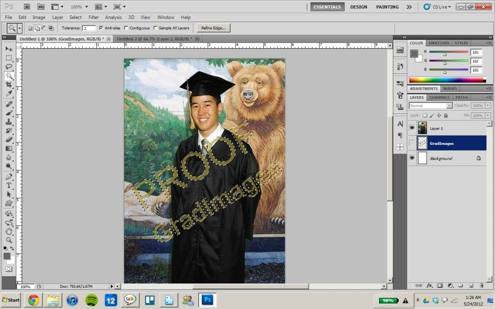](http://www.jessechen.net/blog/wp-content/uploads/2012/05/7.jpg)

_(fig. 7: hiding or moving our black text allows us to apply the selection shape to the original image!)_

Now we want to use the “Refine Edge” tool to adjust our selection shape a bit (remember, we didnt exactly get a perfect fit on the text overlay). At this point, you’ll just have to experiment a bit to get the results you want. You can also use the “Grow...” command from the “Select” menu. Either way, your goal is to surround the entire yellow text so that you don’t end up with any yellow edges.

[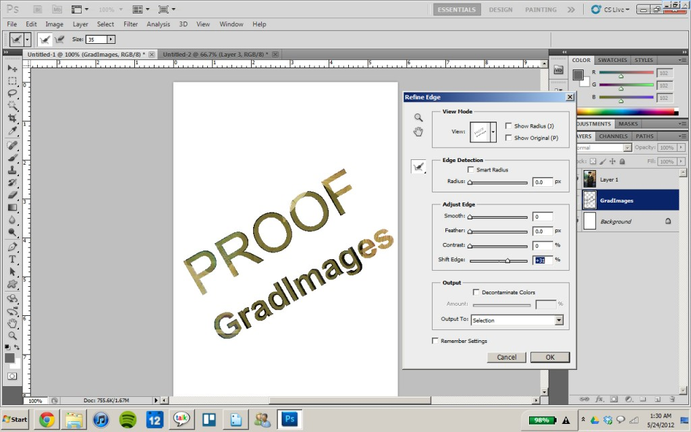](http://www.jessechen.net/blog/wp-content/uploads/2012/05/8.jpg)

_(fig. 8: tweak your selection using “refine edge” or “grow.” As you can see, you want to select a little outside the yellow text, so there’s a dark border around the yellow)_

Once you’re comfortable with your selection, go to Edit > Fill... (or hit SHIFT+F5) to use content aware fill on your selection. We ended up with something like this:

[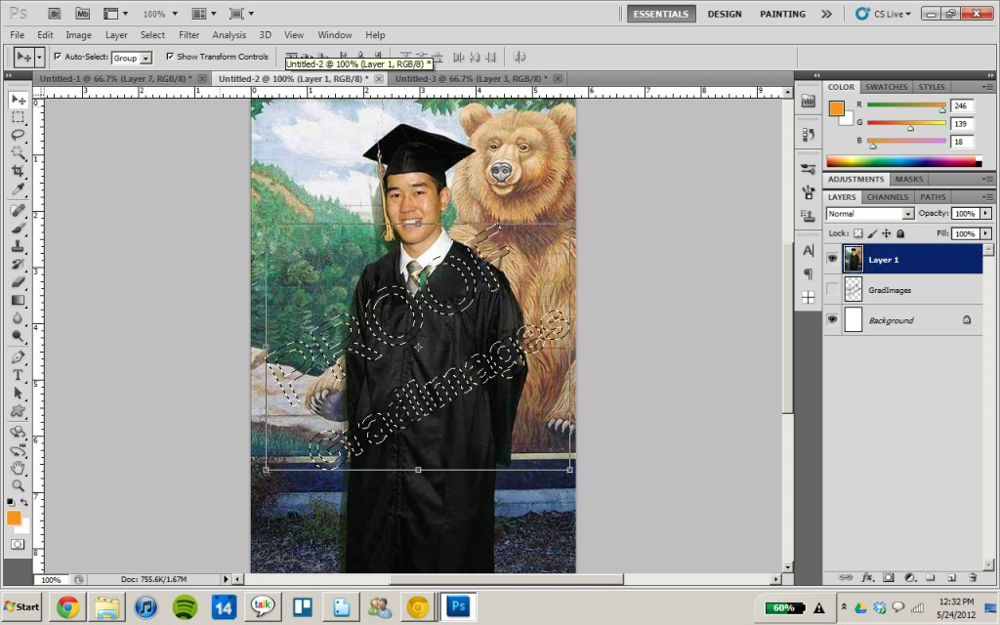](http://www.jessechen.net/blog/wp-content/uploads/2012/05/10.jpg)

_(fig. 10: not perfect, but not bad for free and 5 minutes of work!)_

From this point on, its all manual clean up - and its up to you how much you want to do. I still had some yellow edges left over, so I just quickly cleaned them up using the spot healing brush tool.

[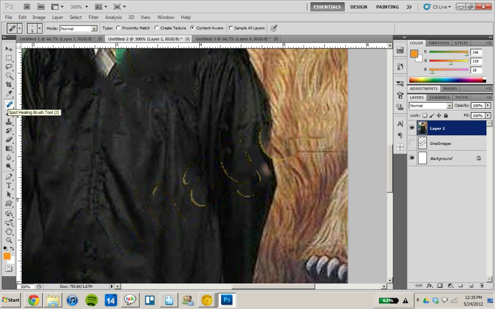](http://www.jessechen.net/blog/wp-content/uploads/2012/05/11.jpg)

_You can also use the regular healing brush to clean up trickier areas, such as Jesse’s collar here._

[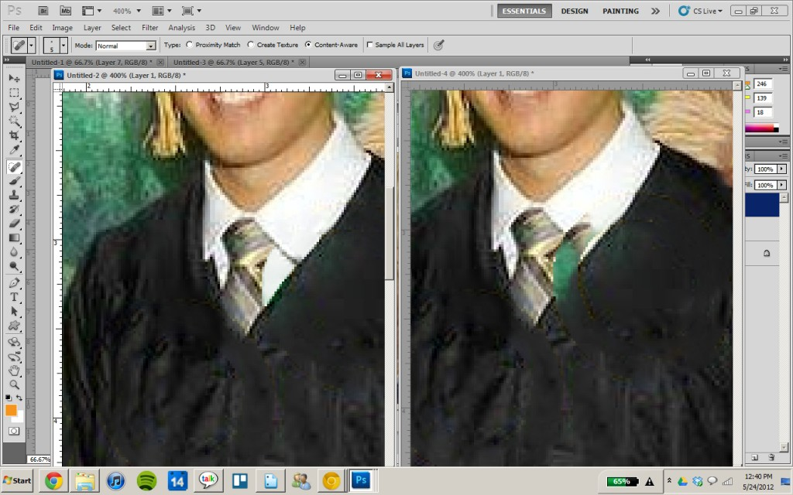](http://www.jessechen.net/blog/wp-content/uploads/2012/05/12.jpg)

_(fig. 12: I used a combination of the Dodge tool and the Healing brush to redraw Jesse’s collar)_

Here’s the finished image:

[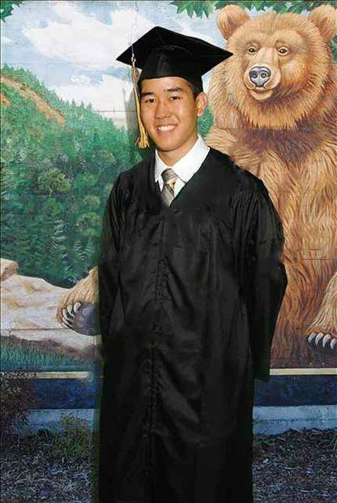](http://www.jessechen.net/blog/wp-content/uploads/2012/05/jesse.jpg)

Of course, it’ll never stand up to close scrutiny, but it’ll pass if you need something quick and dirty. And of course, you can always make things less obvious by applying filters (Instagram, anyone?) or blurring the a duplicate layer and performing an overlay, adjusting brightness/contrast, etc.:

[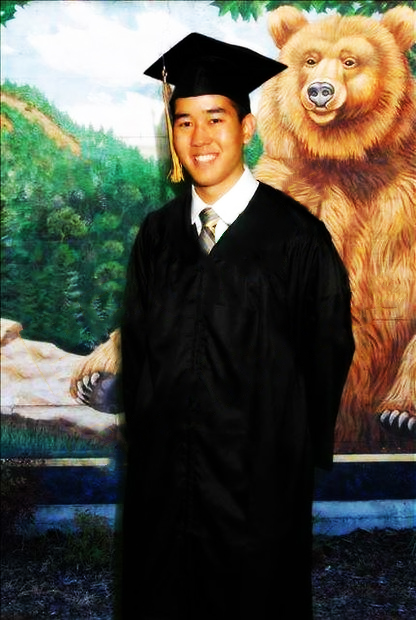](http://www.jessechen.net/blog/wp-content/uploads/2012/05/overlaid.jpg)

### Pwned

We went from a picture that was covered in an ugly copyright overlay and a disgusting yellow proof watermark, to a beautiful and majestic picture that is clean and polished.  No need to "print screen" or take a picture of the monitor in order to share with your family.  We hope that this tutorial helps you by freeing your graduation pictures so that you can take back what's yours to begin with. Now if you'll excuse me, its time to slide back into the comfy warmth of the creepy bear's embrace.

Let us know if this tutorial was useful and any comments or questions below!
